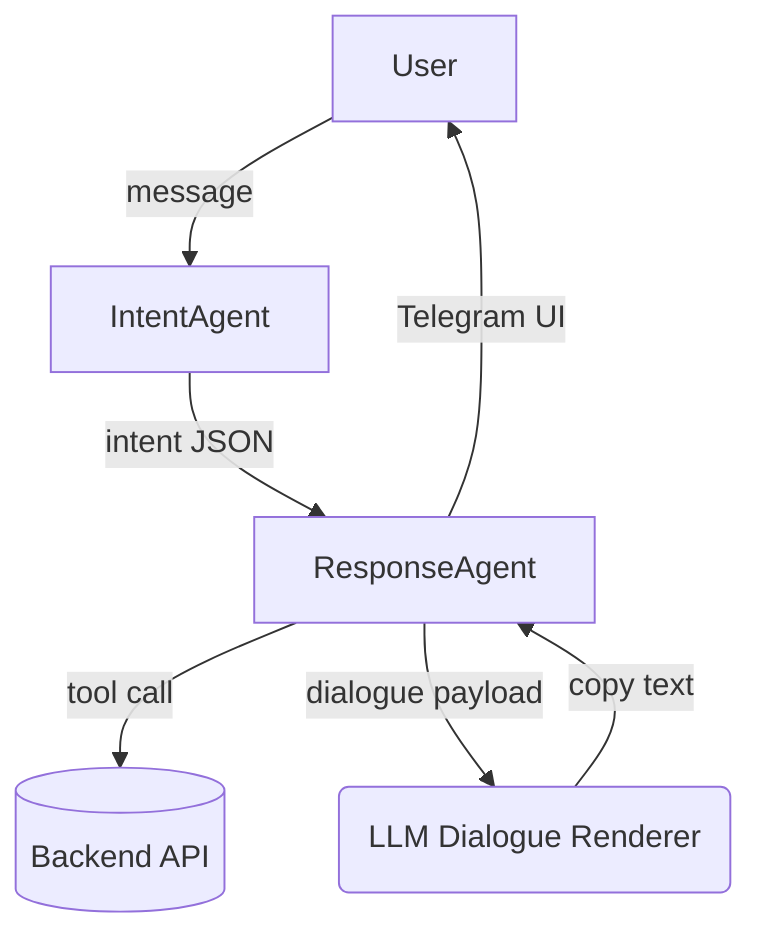

# FundLink Dual-Agent Control Flow

## Overview
FundLink’s Telegram donation bot separates natural-language understanding from deterministic execution. Two cooperative agents share state via lightweight JSON contracts:

- **Intent Agent (LLM front-end):** Classifies every incoming user utterance (or callback payload transformed to text) into `{intent, entities, confidence}`. Heuristics repair typos (e.g., “abouut”), detect affirmative confirmations (“yeah”), and intercept questions about FundLink itself before the full LLM round-trip. Confidence gating falls back to `UNKNOWN` when ambiguity remains.
- **Response Agent (deterministic orchestrator):** Consumes the intent JSON, queries backend tools, renders inline keyboards, and delegates all user-facing prose to a dialogue renderer so the tone stays conversational without hard-coded copy.

A shared per-user state cache (campaign context, token preference, recent listings) enables cross-turn memory while remaining ephemeral.

## Core Flow

### Intent Classification
- **Inputs:** latest user text + state snapshot (current campaign, last shown campaigns, preferred token).
- **Outputs:** intents `VIEW_CAMPAIGNS`, `SELECT_CAMPAIGN`, `DONATE`, `HISTORY`, `HELP`, `UNKNOWN`, along with entities such as `campaign_id`, `amount`, `token`, and flags (`detail`, `about_bot`, `out_of_scope`).
- **Heuristics:**
  - Fuzzy token matching recovers misspelled campaign titles and question words.
  - Pronoun detection (`it`, `this`, `these`) rebinds follow-up questions to the last campaign shown.
  - Affirmatives (“yes”, “yeah”) shortcut to `DONATE` with the active campaign.
  - FundLink metadata questions (`what is FundLink`) map to `HELP` with `about_bot=true`.

### Response Execution
1. **Campaign Discovery (`VIEW_CAMPAIGNS`):**
   - Calls `list_campaigns`, caches first 10 entries, renders inline buttons with compact callback data.
   - Dialogue renderer summarizes up to five campaigns in conversational prose.
2. **Campaign Detail (`SELECT_CAMPAIGN`):**
   - Resolves campaign via ID or fuzzy title match.
   - When `detail=true`, passes description plus quality hints (`ok`, `noisy`, `missing`) to the renderer so gibberish backend text is handled gracefully.
   - Otherwise builds amount-selection keyboard (`min`, `×5`, `×10`, token toggle).
3. **Donation Flow (`DONATE`):**
   - Validates amount >= campaign minimum; if absent or too low, renderer prompts for a valid value while reusing the suggestion buttons.
   - Generates MetaMask deep link using campaign’s wallet/token metadata; provides Fuji network helper link.
   - Clears ephemeral state after delivering the link but retains last-used token preference.
4. **History (`HISTORY`):**
   - Fetches `get_donations` and presents the latest five entries or a “first donation” encouragement.
5. **Help & Unknown (`HELP`, `UNKNOWN`):**
   - `about_bot` → friendly FundLink mission blurb + next steps.
   - `out_of_scope` → polite redirection toward supported actions.
   - Default help lists quick-start buttons for campaigns/history.

### Callback Handling
Inline keyboards encode actions with JSON like `{"a":"sel","c":12}`. `handle_callback_query` decodes the payload and reuses the same deterministic branches (`select_campaign`, `donate_flow`, etc.), ensuring button journeys share the dialogue renderer and tool calls with free-form text.

## Dialogue Generation
- Single LLM system prompt instructs the renderer to return strict JSON `{text, parse_mode}`.
- Payload includes the event (`view_campaigns`, `amount_prompt`, `donation_link`, etc.), relevant data (amounts, titles, tokens), and trimmed state snapshot.
- Fallback copy guarantees graceful degradation if the Together API is unavailable or returns malformed JSON.
- Description sanitation (`_prepare_description`) flags noisy strings so the renderer can acknowledge missing details rather than repeating random characters.

## State Management
- `_USER_STATE` keeps per-telegram-id context: `current_campaign`, `last_shown_campaigns`, token preferences, and pending donation amount.
- `clear_ephemeral_state` resets campaign/amount after generating a deep link while preserving `last_used_token` for convenience.
- Registration cache ensures users are idempotently synced with the Django backend (`user_exists`, `register_user`).

## Extending the Flow
To add new capabilities:
1. **Define Intent & Entities:** Extend the Intent Agent heuristic or few-shot set, return a new intent or entity flag.
2. **Implement Deterministic Branch:** Add a handler branch in the Response Agent to orchestrate backend calls and UI.
3. **Craft Dialogue Payload:** Pass structured data to the renderer and, if needed, update the system prompt + fallback copy.
4. **Wire Buttons:** Encode new callbacks with compact JSON and point them at the new branch.
5. **Test Heuristics & Fallbacks:** Unit tests already exist for intent shortcuts, renderer fallbacks, and donation flow scaffolding—add new cases alongside them.

This architecture keeps the experience conversational while guaranteeing that every backend call, validation, and deep-link generation is deterministic, observable, and easy to extend.
